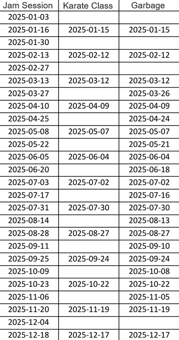
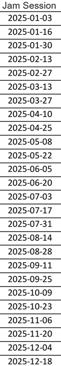
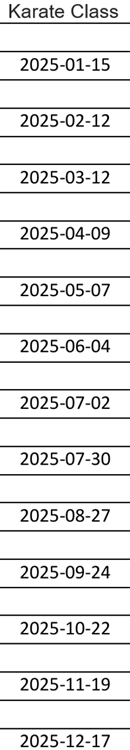
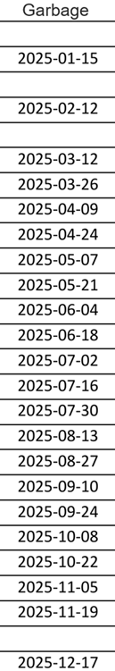
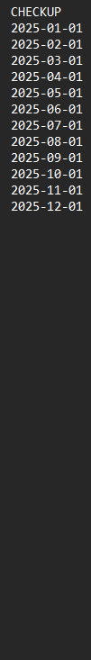
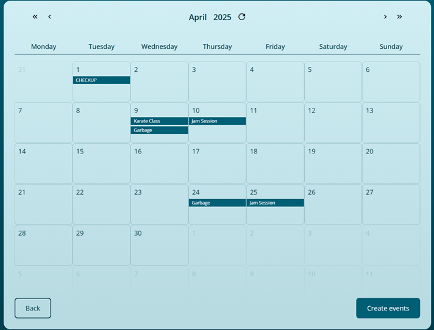
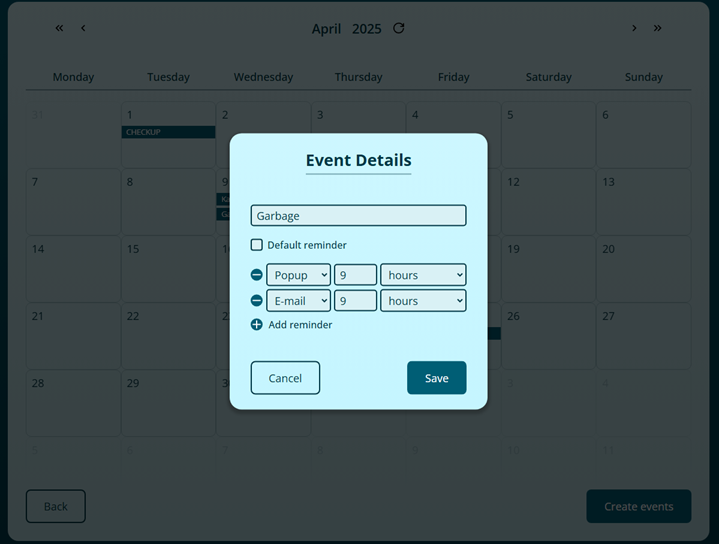
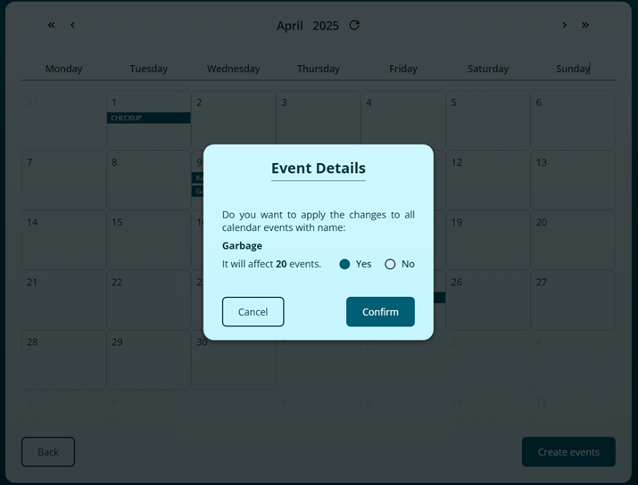

# 📅 Google Calendar Event Creator

This lightweight browser-based tool lets you quickly create multiple **full-day events** in your Google Calendar. It uses **Optical Character Recognition (OCR)** to extract dates from an image of a table column or simply reads a text file and creates events.

> ⚠️ **Note**: Time isn’t supported (I didn’t need it), so all events are created as full-day events.

## ✨ How It Works

Upload an image (`.png`) or text file (`.txt`) containing a table column where:

- The **first cell** is the **event title**.
- The **remaining cells** are dates in **ISO 8601 format** (e.g., `yyyy-MM-dd`, like `2025-03-06`).

### Example Input

For a full table like this:



1. **Cut the table into separate columns** for better OCR accuracy. You can use Windows Snipping Tool (Win + Shift + s) to take a screenshot and save it.
2. Upload each column as a `.png` file.
3. You can also upload additional `.txt` files at the same time. Each file acts as a separate column.

Here’s how it looks with 3 images and 1 text file:

| 📸 column-1.png                                | 📸 column-2.png                                | 📸 column-3.png                                | 📝 column-4.txt                                |
| ---------------------------------------------- | ---------------------------------------------- | ---------------------------------------------- | ---------------------------------------------- |
|  |  |  |  |

- **Unlimited files**: Upload as many `.png` or `.txt` files as you want.
- **Mixed uploads**: Combine images and text files in one go.
- **Skipping blanks**: Empty or missing cells are ignored.

> ⚠️ **Heads-up**: Invalid dates, past dates, or low-quality images might cause missing events. Double-check your calendar before creating events!

### Example Output

Here’s what your events might look like in the calendar view:



## 🛠️ Customization Options

You can tweak events after creation:

- **Edit a single event**: Change the title or add a reminder.
- **Bulk edit**: For ease of use, you can edit multiple events at once after confirmation, if they have the same title. You can still change the title itself and the change will apply to all those events, just as you want.

| ✏️ You can edit the title and reminders             | 📦 After clicking the `Save` button you will be prompted for bulk editing |
| --------------------------------------------------- | ------------------------------------------------------------------------- |
|  |                  |

## ✅ Transferring events to your Google Calendar

Events aren’t added to your Google Calendar immediately. Instead, you have full control to review and adjust them before committing:

- **Preview & Edit**: Tweak your events in the calendar view.
- **Discard Options**: Go back or close the browser tab to cancel everything.
- **Create Events**: Click the `Create events` button (bottom-right corner) to send them to Google Calendar.

> ⏳ **Be Patient**: Once you click the button, transferring events may take a moment. The Google API has rate limits, so the more events you’re creating, the longer this process will take.

## 📋 Prerequisites

- **Node.js**: Version 14 or later (install from [nodejs.org](https://nodejs.org/)).
- **Google Account**: Required for Calendar authentication (you’ll be prompted).
- **Browser**: A modern one like Chrome or Firefox.

## 🚀 Running the Application

1. Clone the repository:
   ```bash
   git clone <repository-url>
   cd <repository-folder>
   ```
2. Run `npm start` command in the terminal.
3. If the application page doesn't automatically open, navigate to `localhost:3000` in your browser.
